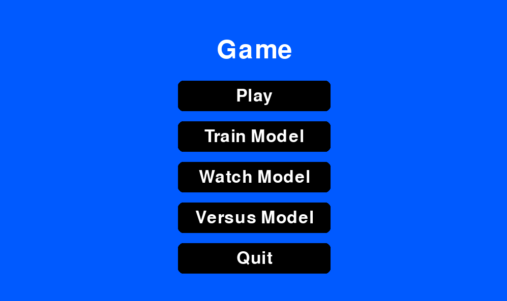
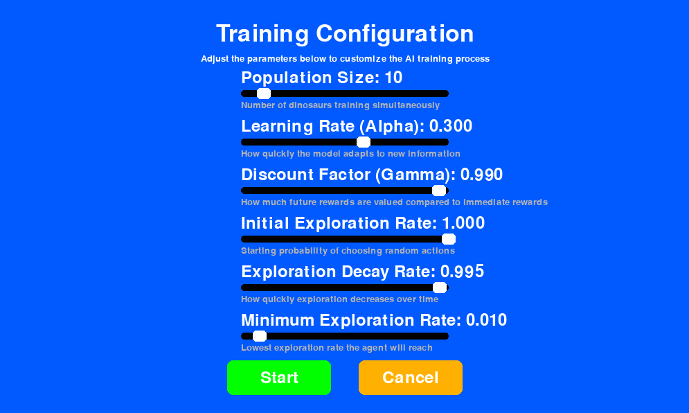
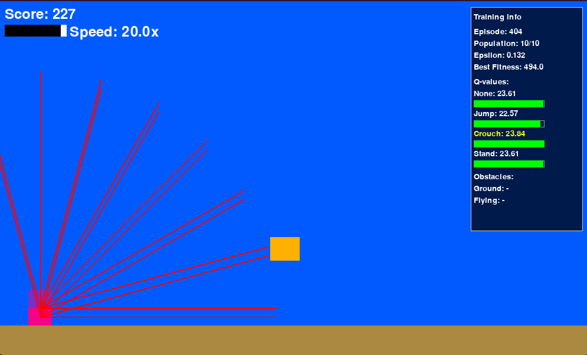
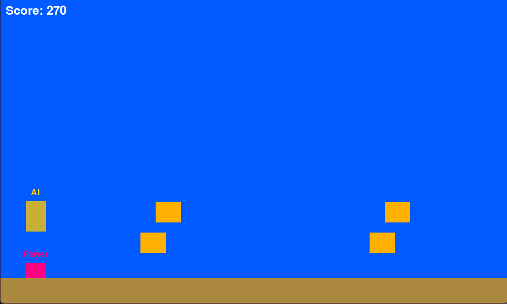

# AI-DINO-RUNNER

A project developed to explore reinforcement learning applied to games, using Q-Learning in a Dino Runner-style environment built with Python and Pygame.

---

## 🧠 About

This project is a hands-on implementation of Q-Learning applied to a simple Dino Runner-style game. It was developed during vacation with the goal of learning Machine Learning in practice and understanding how different parameters affect learning behavior.

Features:
- Real-time visualization of the AI training process.
- Game modes: **play solo**, **watch the AI play**, **play against the AI**, **custom AI training**.
- Deeper customization through configuration files.

---

## ⚙️ Configurable Parameters

- `alpha`: learning rate.
- `gamma`: discount factor.
- `epsilon`: exploration rate.
- `population_size`: number of agents per generation.
- Rewards and penalties for specific actions (configurable via `settings` file).
- Object sizes and game speed (configurable via `settings` file).

---

## 🧬 Training Dynamics

- Training occurs in generations with multiple agents.
- At the end of each generation, the top-performing agent is selected.
- The best agent's Q-table is propagated to initialize the next generation.
- This process accelerates convergence and refines behavior over time.

---

## 🖼️ Screenshots

| Main Menu | Settings Screen |
|-----------|------------------|
|  |  |

| AI Training | Versus Mode |
|-------------|-------------|
|  |  |

